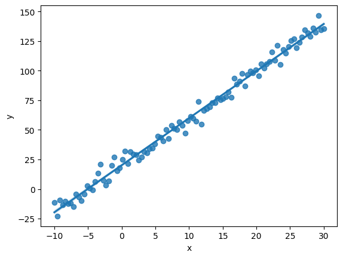

# Investigar y describir un ejercicio de Inferencia por verosimilitud
## Mitsiu Alejandro Carreño Sarabia - E23S-18014

## Inferencia por verosimilitud
Una función de verosimilitud es la probabilidad conjunta de los datos observados interpretados como una función dados ciertos parámetros de un modelo. Nos permite estimar qué tan “creíbles” son los datos, dados ciertos parámetros.

Es posible elegir un valor a cierto parámetro dado que sea el más creíble, es decir, el que maximiza la verosimilitud.

Otro posible uso de una función de verosimilitud para cada posible valor y tener una visión más completa del comportamiento de los datos.
 
## Implementación en python

Se cargan distintas librerías de calculos matemáticos, gráficar, estimaciones etc
```python
# Librería para realizar operaciones en vectores
import numpy as np
# Librería para manipulación y análisis de datos
import pandas as pd
# Librería para gráficar
from matplotlib import pyplot as plt
# Librería para gráficas
import seaborn as sns
# Librería con distintos modelos estadísticos y de estimación
from statsmodels import api
# Librería con diversas distribuciones 
from scipy import stats
# Librería para minimizar funciones respecto a una entrada dada
from scipy.optimize import minimize
```

Generamos datos simulando los datos de muestreo
```python
# Nuestra variable independiente con 100 valores distribuidos entre -10 y 30 
x = np.linspace(-10, 30, 100)

# Nuestro error (azar) que sigue una distribución normal (Gausseana) 
# 100 valores con un promedio 10 y una desviación estandar 5
e = np.random.normal(10, 5, 100)

# Generamos nuestra variable dependiente con una relación líneal
y = 10 + 4*x + e

# Guardamos en un dataframe los valores de la variable dependiente e independiente
df = pd.DataFrame({'x':x, 'y':y})
```

Podemos generar una visualización con nuestras variables y una regresión líneal
```python
sns.regplot(x='x', y='y', data = df)
plt.show()
```


Definimos nuestra función de estimación de máxima verosimilitud (Maximum Likelihood Estimation o MLE), recordemos que esta función es la que se minimizará mediante scipy.optimize [Referencia](https://docs.scipy.org/doc/scipy/reference/generated/scipy.optimize.minimize.html#scipy.optimize.minimize)
```python
def MLE_Norm(parameters):
  # Expandimos los parametros que en este caso corresponden a los componentes de la regresión líneal
  # const es el intercepto 
  # beta es la pendiente
  # std_dev es el error
  const, beta, std_dev = parameters
  
  # Nuestra predicción es la ecuación de la recta (igual por tratarse de una regresión líneal) 
  # variable dependiente = intercepto +  pendiente * variable dependiente
  # en otras palabras
  # y = B0 + B1x + e
  pred = const + beta*x

  # Aquí se aplica una optimización, la estimación de máxima verosimilitud es una función estrictamente creciente, es lo mismo que maximizar su forma logarítmica
  # Así que al obtener su forma logarítmica "stats.norm.logpdf" podemos convertir la función de producto (multiplicación) en una función de suma 
  # Lo cuál es computacionalmente más sencillo y rápido
  LL = np.sum(stats.norm.logpdf(y, pred, std_dev))
  # Finalmente por haber pasado de la forma creciente a la forma logaritmica y que en general intentamos obtener un valor máximo, regresamos el valor negativo de la función logaritmica
  neg_LL = -1*LL
  return neg_LL
```

Invocamos la función minimize [Referencia](https://docs.scipy.org/doc/scipy/reference/generated/scipy.optimize.minimize.html#scipy.optimize.minimize) y la función que queremos minimizar es justo la función de estimación de máxima verosimilitud (MLE_Norm) 
```python
# El primer parametro es nuestra función la cuál de manera interna 'minimize' va a iterar, 
# nuestro segundo parametro corresponde a los valores iniciales que se enviaran a la función MLE_Norm (arriba definidos como const (intercepto), beta (pendiente), std_dev (error))
# finalmente el tercer parametro indica a minimize el algoritmo mediante el cuál se va a minimizar
mle_model = minimize(MLE_Norm, np.array([2,2,2]), method='L-BFGS-B')
mle_model
```

Con el cuál se obtiene el siguiente resultado
>   message: CONVERGENCE: REL_REDUCTION_OF_F_<=_FACTR*EPSMCH      
>   success: True        
>    status: 0      
>       fun: 299.1794494107708       
>         x: [ 2.015e+01  3.977e+00  4.820e+00]      
>       nit: 29       
>       jac: [-5.684e-06  1.251e-04 -5.684e-06]      
>      nfev: 144       
>      njev: 36        
>  hess_inv: <3x3 LbfgsInvHessProduct with dtype=float64>    

Donde claramente podemos observar el arreglo x: [ 2.015e+01  3.977e+00  4.820e+00]
resultando en un intercepto 20.15, pendiente 3.977 y un error 4.82 que corresponde con los datos que ingresamos al generar los datos (recodemos que el error en la ecuación de la recta corresponde con la desviación estandar ingresada 5) igual que la pendiente 4 y el intercepto lo podemos confirmar cuando gráficamos los datos.

También cabe destacar que llegar a estos resultados solo tomo 36 iteraciones (para un conjunto de 100 ejemplos).

## Conclusiones
Como se apreció en el código anterior, únicamente a partir de datos, y aprovechando el poder y velocidad de los equipos modernos de cómputo es posible estimar cualquier variable estadística de interés, además de ello me resulta bastante interesante los métodos de optimización que se llegan a emplear y la precisión de los datos que se obtuvieron, así como la eficiencia de requerir la menor cantidad de iteraciones, aumentando la escalabilidad del algoritmo a grandes volúmenes de información para que se procesen en el menor tiempo posible.

## Referencia de código
[https://github.com/RajkumarGalaxy/StructuredData/blob/master/MLE_Maximum_Likelihood_Estimation.ipynb](https://github.com/RajkumarGalaxy/StructuredData/blob/master/MLE_Maximum_Likelihood_Estimation.ipynb)
