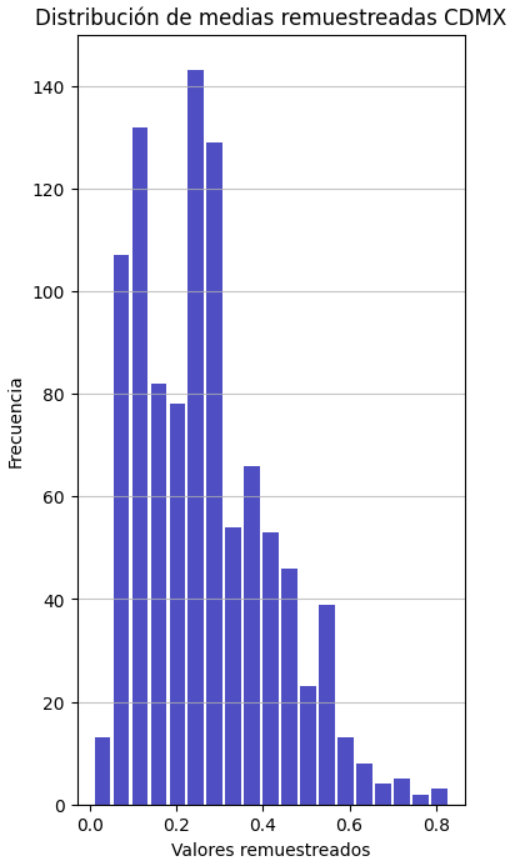

# Práctica sobre inferencia estadística
## Mitsiu Alejandro Carreño Sarabia - E23S-18014

**¿Existe diferencia estadísticamente significativa entre la precipitación pluvial de la ciudad de Londres y de CDMX?**

## Introducción

Se desea analizar y conocer mediante métodos estadísticos si existen similitudes o diferencias entre la precipitación pluvial en Londres y la Ciudad de México, para ello se decidió realizar un análisis de intervalos de confianza en datos los cuales previamente fueron complementados con la técnica de remuestreo Bootstrap para calcular el promedio de precipitación en un periodo definido y comparar ambas regiones, empleando estas técnicas se espera obtener un resultado insesgado que permita generalizar los datos más allá de los límites temporales y de medición con que se cuentan de manera original.

## Datos
Los datos empleados corresponden al año 2020 comprendiendo un periodo de 7 meses correspondientes al primer semestre del año, siendo específico, el periodo comprende entre el 21 de enero de 2020 al 26 de julio de 2020. Dichos datos se obtuvieron de la Oficina Nacional de Administración Oceánica y Atmosférica (National Oceanic and Atmospheric Administration, NOAA)y comprende de 23 características que se listan a continuación:
- STATION: Identificador de la estación que realizó la medición.
- Country/Region: Región o país en que se ubica la estación de medición.
- DATE: Fecha de medición (formato año-mes-dia).
- Year: Año en que se registró la medición.
- Month: Mes en que se registró la medición.
- Day: Día en que se registró la medición.
- PRCP: Cantidad de precipitación.
- SNWD: Profundidad de nieve respecto al suelo.
- TAVG: Temperatura promedio.
- TMAX: Temperatura máxima.
- TMIN: Temperatura mínima.
- SNOW: Cantidad de nieve.
- LATITUDE: Latitud geográfica de la ubicación de la estación.
- LONGITUDE: Longitud geográfica de la ubicación de la estación.
- ELEVATION: Elevación geográfica de la ubicación de la estación.
- PRCP_ATTRIBUTES: Atributos extra para la información de precipitación.
- TAVG_ATTRIBUTES: Atributos extra para la información de temperatura promedio.
- TMAX_ATTRIBUTES: Atributos extra para la información de temperatura máxima.
- TMIN_ATTRIBUTES: Atributos extra para la información de temperatura mínima.
- DAPR: Cantidad de días desde la última precipitación.
- MDPR: Cantidad de precipitación total considerando múltiples días.
- WESD: Equivalente en agua de la profundidad de la nieve respecto al suelo.
- SNWD_ATTRIBUTES: Atributos extra para la información de profundidad de nieve.

De los cuales se empleó "Country/Region", "STATION" y "PRCP" para realizar el análisis.
 
## Análisis inicial
A pesar de que el dataset cuenta con información de 155 países comprendidos en 1026119 renglones, derivado del análisis inicial se identificó que las fechas para el país México se duplicaban, y el dataset completo a pesar de contar con las características latitud y longitud se encuentra completamente vacíos por lo que fue necesario investigar el significado del campo "Station" para ubicar a qué región dentro del país pertenecía cada renglón.
Afortunadamente la Oficina Nacional de Administración Oceánica y Atmosférica cuenta con el portal *https://www.ncei.noaa.gov/access/search/data-search/global-summary-of-the-month* que permite búsquedas georeferenciadas y regresa los identificadores de estaciones en el área seleccionada, por lo que se descubrió que la estación más cercana a la Ciudad de México es **"MXM00076680"** y a Londres **"UKE00105657"**.
Limitando nuestro dataset a 123 renglones para la Ciudad de México y 188 renglones para Londres, los cuales se comportan de la siguiente manera:

#### Estimadores puntuales
|         |  Minimo | Maximo | Promedio         | Varianza       |  Desv. estándar |
|---------|---------|--------|------------------|----------------|-----------------|
| CdMx    | 0.0     | 17.3   | 0.26842105263    | 2.8076665114   | 1.6756092955    |
| Londres | 0.0     | 33.4   | 2.08936170212    | 21.119244510   | 4.5955679203    |

### Registros pluviales en México 2020

### Registros pluviales en Londres 2020


## Remuestreo Bootstrap
A partir únicamente de los estimadores puntuales es posible notar comportamientos distintos en ambas ciudades pero considerando la limitada cantidad de datos (180 renglones) se decidió aplicar la técnica de remuestreo bootstrap.
Recordemos que el remuestreo Bootstrap es una técnica que consiste en muestrear de manera aleatoria nuestra muestra original con reemplazo (variante en la que un mismo elemento puede aparecer múltiples veces en el submuestreo). 

### Bootstrap promedio CDMX
```python
# Nuestra muestra son los datos de la estación de México
mx_sample_data = df \
    .query("STATION=='MXM00076680'")["PRCP"] \
    .dropna() \
    .to_numpy()

# Cantidad de submuestras a generar
num_samples = 1000  

# Lista para guardar los promedios generados (u otro estimador)
mx_bootstrap_means = []

# Realizar remuestreo
for _ in range(num_samples):
    # Generamos submuestra con reemplazo
    bootstrap_sample = np.random.choice(
        mx_sample_data, 
        size=len(mx_sample_data), 
        replace=True)
    # Calculamos el estimador puntual de interés y lo guardamos
    mx_bootstrap_means.append(np.mean(bootstrap_sample))
```
Ejemplo de resultado:      
[0.13859649122807016, 0.45964912280701753, 0.11578947368421053, 0.19561403508771932, 0.2219298245614035, 0.08157894736842106, 0.4026315789473684, 0.287719298245614, 0.07894736842105263, 0.35526315789473684, 0.21578947368421053, 0.2710526315789474, 0.12894736842105262, 0.0719298245614035, ...]



### Bootstrap promedio Londres
```python
# Nuestra muestra son los datos de la estación de Londres
ln_sample_data = df \
    .query("STATION=='UKE00105657'")["PRCP"] \
    .to_numpy()

# Cantidad de submuestras a generar
num_samples = 1000

# Lista para guardar los promedios generados (u otro estimador)
ln_bootstrap_means = []

# Realizar remuestreo
for _ in range(num_samples):
    # Generamos submuestra con reemplazo
    bootstrap_sample = np.random.choice(
        ln_sample_data, 
        size=len(ln_sample_data), 
        replace=True)
    # Calculamos el estimador puntual de interés y lo guardamos
    ln_bootstrap_means.append(np.mean(bootstrap_sample))
```


## Intervalos de confianza
Una vez que se completó el proceso de remuestreo, es posible generar intervalos de confianza (aunque cabe resaltar que también es posible generar los intervalos de confianza sin requerir remuestreo pero para este ejercicio se consideró apropiado).
Un intervalo de confianza es un intervalo en el cuál se espera que contenga el valor del parámetro estimado, en este caso, el promedio.
 
```python
# Calculamos el intervalo de confianza (al 95%)
mx_confidence_interval = np.percentile(mx_bootstrap_means, [2.5, 97.5])
ln_confidence_interval = np.percentile(ln_bootstrap_means, [2.5, 97.5])
```
Ejemplo de resultado:     
Ciudad de México: array([0.06138158, 0.5904386 ])     
Londres: array([1.49135638, 2.7618617 ])      

## Conclusiones
Después de haber realizado el remuestreo y obtener los intervalos de confianza, se confirma la suposición inicial, que desde las gráficas de línea de tiempo de precipitación y la tabla de estimadores puntuales, en los que se notaban tendencias muy diferentes en la cantidad de precipitación, frecuencia e intensidad. Pero al agregar estas técnicas de estadística inferencial, se logró dar un análisis y enfoque más completo.
Finalmente, queda pendiente buscar un dataset que logre abarcar un año completo, ya que si bien se nota un aumento considerable en los últimos días registrados en CDMX, no se cuentan con los datos suficientes (ni siquiera remuestreado) como para evaluar si a final de año se logra equiparar la cantidad de precipitación registrada en Londres.

## Fuentes
- https://www.ncei.noaa.gov/access/search/data-search/global-summary-of-the-month
- https://www.kaggle.com/datasets/amirhoseinsedaghati/the-weather-of-187-countries-in-2020
- https://www.statology.org/plot-confidence-interval-python/
- https://datagy.io/python-confidence-intervals/
